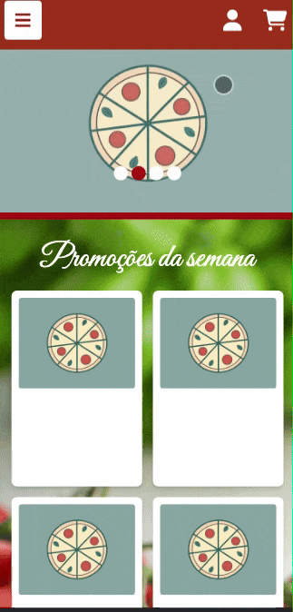
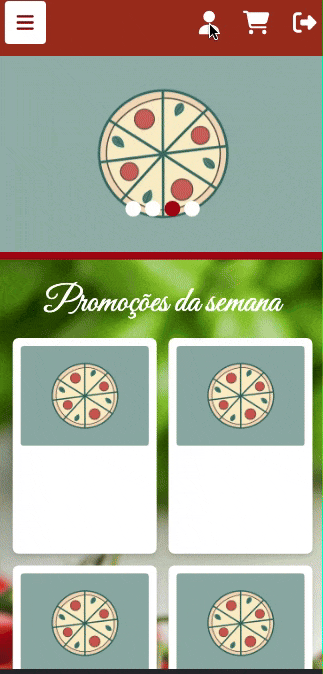
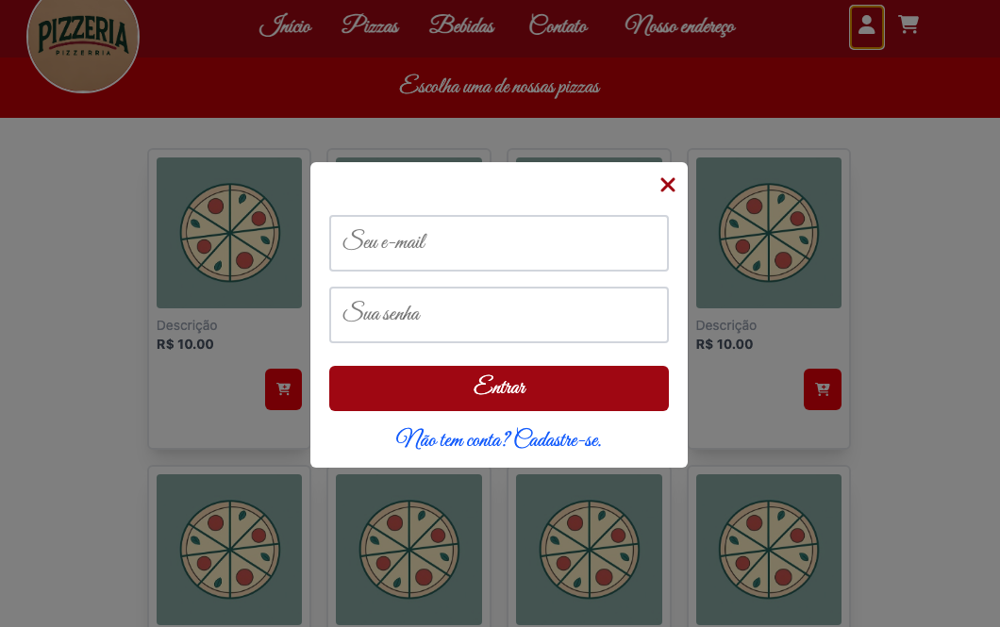
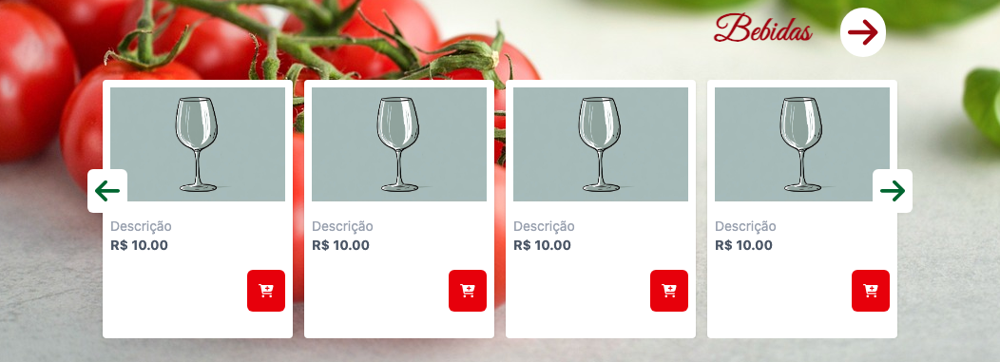

# Pizzaria

Este projeto é o front-end de um site de pizzaria. 
Foi criado visando homenagear a minha comida favorita, a pizza, e claro, praticar as tecnologias que me dedico a estudar.
Como em qualquer sistema, sempre há algo novo a ser acrescentado e/ou atualizado, portanto, limitei-me a desenvolver 
as funcionalidades básicas, deixando espaço para ideias que surgirem. 

## Demonstração








## Tecnologias utilizadas

- ⚙️ TypeScript
- ⚙️ React
- ⚙️ Tailwind CSS

## Funcionalidades

- ✅ Layout responsivo
- ✅ Navegação por seções
- ✅ Scroll suave

## Como rodar o projeto

Para iniciar o projeto em modo de desenvolvimento:

```bash
npm start
```
Para gerar os arquivos otimizados para produção:

```bash
npm build
```

