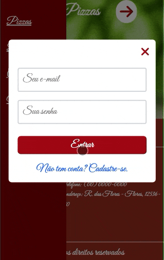

# Pizzeria

Este projeto é o front-end de um site de pizzaria. 
Foi criado para homenagear a pizza (gosto muito 😅) e praticar as tecnologias que me dedico a estudar.

Como em qualquer sistema, sempre há algo novo a ser acrescentado ou atualizado. Portanto, optei por desenvolver apenas as funcionalidades básicas, deixando espaço para futuras ideias e melhorias.

## Demonstração





## Tecnologias utilizadas

- ⚙️ TypeScript
- ⚙️ React
- ⚙️ Tailwind CSS

## Funcionalidades

- ✅ Layout responsivo
- ✅ Navegação por seções
- ✅ Scroll suave

## Como rodar o projeto

Para iniciar em modo de desenvolvimento:

```bash
npm run dev
```
Para gerar os arquivos otimizados para produção:

```bash
npm run build
```

